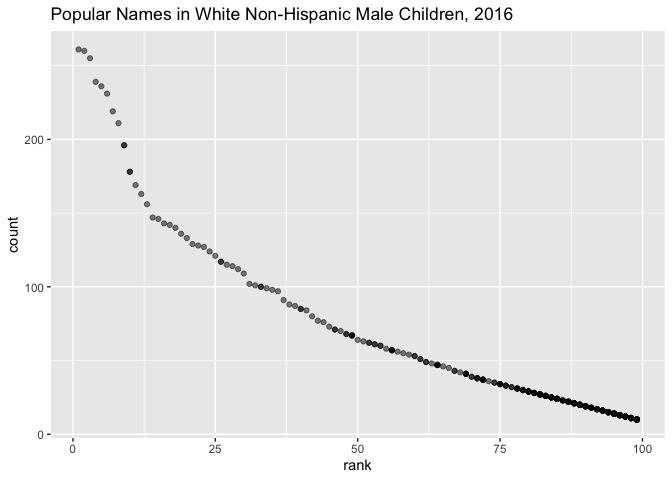

p8105\_hw2\_jf3354
================
Judy Fordjuoh
October 2, 2021

``` r
library(tidyverse)
```

    ## ── Attaching packages ─────────────────────────────────────── tidyverse 1.3.1 ──

    ## ✓ ggplot2 3.3.5     ✓ purrr   0.3.4
    ## ✓ tibble  3.1.4     ✓ dplyr   1.0.7
    ## ✓ tidyr   1.1.3     ✓ stringr 1.4.0
    ## ✓ readr   2.0.1     ✓ forcats 0.5.1

    ## ── Conflicts ────────────────────────────────────────── tidyverse_conflicts() ──
    ## x dplyr::filter() masks stats::filter()
    ## x dplyr::lag()    masks stats::lag()

``` r
library(readxl)
library(haven)
library(dplyr)
```

\#\#PROBLEM 1

``` r
TW_df = read_excel("MrTrashnew.xlsx", sheet = 'MrTrashWheel', range = 'A2:N535') %>%
    janitor::clean_names() %>%
    mutate(sports_balls = round(sports_balls)) %>%
    drop_na(dumpster) #dropping all the rows in dumpster that has a NA

TW19_df = TW_df %>%
  filter(year == "2019") %>%  
  select(year, sports_balls)
  
summary(TW19_df)
```

    ##       year       sports_balls  
    ##  Min.   :2019   Min.   : 0.00  
    ##  1st Qu.:2019   1st Qu.: 4.00  
    ##  Median :2019   Median : 9.00  
    ##  Mean   :2019   Mean   :10.03  
    ##  3rd Qu.:2019   3rd Qu.:14.00  
    ##  Max.   :2019   Max.   :32.00

``` r
summary(TW_df)
```

    ##    dumpster            month                year     
    ##  Length:454         Length:454         Min.   :2014  
    ##  Class :character   Class :character   1st Qu.:2015  
    ##  Mode  :character   Mode  :character   Median :2018  
    ##                                        Mean   :2017  
    ##                                        3rd Qu.:2019  
    ##                                        Max.   :2021  
    ##                                        NA's   :1     
    ##       date                      weight_tons       volume_cubic_yards
    ##  Min.   :1900-01-20 00:00:00   Min.   :   0.780   Min.   :   7.00   
    ##  1st Qu.:2015-12-26 00:00:00   1st Qu.:   2.720   1st Qu.:  15.00   
    ##  Median :2018-02-05 00:00:00   Median :   3.190   Median :  15.00   
    ##  Mean   :2017-07-03 05:36:57   Mean   :   6.386   Mean   :  30.76   
    ##  3rd Qu.:2019-05-28 00:00:00   3rd Qu.:   3.680   3rd Qu.:  15.00   
    ##  Max.   :2021-01-04 00:00:00   Max.   :1449.700   Max.   :6982.00   
    ##  NA's   :1                                                          
    ##  plastic_bottles   polystyrene     cigarette_butts    glass_bottles     
    ##  Min.   :   210   Min.   :   210   Min.   :     980   Min.   :    0.00  
    ##  1st Qu.:   980   1st Qu.:   950   1st Qu.:    5000   1st Qu.:    9.25  
    ##  Median :  1850   Median :  1650   Median :   11000   Median :   18.00  
    ##  Mean   :  3790   Mean   :  3833   Mean   :   48935   Mean   :   44.81  
    ##  3rd Qu.:  2640   3rd Qu.:  2730   3rd Qu.:   32750   3rd Qu.:   32.00  
    ##  Max.   :860215   Max.   :870177   Max.   :11108320   Max.   :10171.00  
    ##                                                                         
    ##   grocery_bags        chip_bags         sports_balls     homes_powered     
    ##  Min.   :    50.0   Min.   :   180.0   Min.   :   0.00   Min.   :    0.00  
    ##  1st Qu.:   426.2   1st Qu.:   802.5   1st Qu.:   5.00   1st Qu.:   38.88  
    ##  Median :   820.0   Median :  1333.5   Median :   9.00   Median :   51.17  
    ##  Mean   :  2201.5   Mean   :  3107.4   Mean   :  23.43   Mean   :   90.44  
    ##  3rd Qu.:  1627.5   3rd Qu.:  2150.0   3rd Qu.:  16.00   3rd Qu.:   58.79  
    ##  Max.   :499448.0   Max.   :704792.0   Max.   :5315.00   Max.   :20530.00  
    ## 

``` r
skimr::skim(TW_df)
```

|                                                  |        |
|:-------------------------------------------------|:-------|
| Name                                             | TW\_df |
| Number of rows                                   | 454    |
| Number of columns                                | 14     |
| \_\_\_\_\_\_\_\_\_\_\_\_\_\_\_\_\_\_\_\_\_\_\_   |        |
| Column type frequency:                           |        |
| character                                        | 2      |
| numeric                                          | 11     |
| POSIXct                                          | 1      |
| \_\_\_\_\_\_\_\_\_\_\_\_\_\_\_\_\_\_\_\_\_\_\_\_ |        |
| Group variables                                  | None   |

Data summary

**Variable type: character**

| skim\_variable | n\_missing | complete\_rate | min | max | empty | n\_unique | whitespace |
|:---------------|-----------:|---------------:|----:|----:|------:|----------:|-----------:|
| dumpster       |          0 |              1 |   1 |  11 |     0 |       454 |          0 |
| month          |          1 |              1 |   3 |   9 |     0 |        13 |          0 |

**Variable type: numeric**

| skim\_variable       | n\_missing | complete\_rate |     mean |        sd |      p0 |     p25 |      p50 |      p75 |       p100 | hist  |
|:---------------------|-----------:|---------------:|---------:|----------:|--------:|--------:|---------:|---------:|-----------:|:------|
| year                 |          1 |              1 |  2017.26 |      1.95 | 2014.00 | 2015.00 |  2018.00 |  2019.00 |     2021.0 | ▆▃▇▃▃ |
| weight\_tons         |          0 |              1 |     6.39 |     67.89 |    0.78 |    2.72 |     3.19 |     3.68 |     1449.7 | ▇▁▁▁▁ |
| volume\_cubic\_yards |          0 |              1 |    30.76 |    326.96 |    7.00 |   15.00 |    15.00 |    15.00 |     6982.0 | ▇▁▁▁▁ |
| plastic\_bottles     |          0 |              1 |  3789.49 |  40295.85 |  210.00 |  980.00 |  1850.00 |  2640.00 |   860215.0 | ▇▁▁▁▁ |
| polystyrene          |          0 |              1 |  3833.38 |  40765.80 |  210.00 |  950.00 |  1650.00 |  2730.00 |   870177.0 | ▇▁▁▁▁ |
| cigarette\_butts     |          0 |              1 | 48935.33 | 521172.52 |  980.00 | 5000.00 | 11000.00 | 32750.00 | 11108320.0 | ▇▁▁▁▁ |
| glass\_bottles       |          0 |              1 |    44.81 |    476.61 |    0.00 |    9.25 |    18.00 |    32.00 |    10171.0 | ▇▁▁▁▁ |
| grocery\_bags        |          0 |              1 |  2201.50 |  23404.23 |   50.00 |  426.25 |   820.00 |  1627.50 |   499448.0 | ▇▁▁▁▁ |
| chip\_bags           |          0 |              1 |  3107.37 |  33017.93 |  180.00 |  802.50 |  1333.50 |  2150.00 |   704792.0 | ▇▁▁▁▁ |
| sports\_balls        |          0 |              1 |    23.43 |    249.06 |    0.00 |    5.00 |     9.00 |    16.00 |     5315.0 | ▇▁▁▁▁ |
| homes\_powered       |          0 |              1 |    90.44 |    961.64 |    0.00 |   38.88 |    51.17 |    58.79 |    20530.0 | ▇▁▁▁▁ |

**Variable type: POSIXct**

| skim\_variable | n\_missing | complete\_rate | min        | max        | median     | n\_unique |
|:---------------|-----------:|---------------:|:-----------|:-----------|:-----------|----------:|
| date           |          1 |              1 | 1900-01-20 | 2021-01-04 | 2018-02-05 |       275 |

``` r
prep_2019 = read_excel("MrTrashnew.xlsx", sheet = '2019 Precipitation',range = 'A2:B14') %>%
  drop_na() %>%
  mutate(year = "2019")
   
prep_2018 = read_excel("MrTrashnew.xlsx", sheet = '2018 Precipitation', range = 'A2:B14') %>%  
    mutate(year = "2018")
    
##I also got rid of the last row which was the total precipitations

precip18_19 = 
  bind_rows(prep_2019, prep_2018) %>%
  arrange(year,Month, Total) %>% 
  mutate(Month = month.name[Month]) 

summary(prep_2019)
```

    ##      Month           Total           year          
    ##  Min.   : 1.00   Min.   :0.160   Length:12         
    ##  1st Qu.: 3.75   1st Qu.:1.760   Class :character  
    ##  Median : 6.50   Median :3.335   Mode  :character  
    ##  Mean   : 6.50   Mean   :2.829                     
    ##  3rd Qu.: 9.25   3rd Qu.:3.692                     
    ##  Max.   :12.00   Max.   :5.450

``` r
summary(precip18_19)
```

    ##     Month               Total            year          
    ##  Length:24          Min.   : 0.160   Length:24         
    ##  Class :character   1st Qu.: 2.322   Class :character  
    ##  Mode  :character   Median : 3.745   Mode  :character  
    ##                     Mean   : 4.345                     
    ##                     3rd Qu.: 5.615                     
    ##                     Max.   :10.470

``` r
skimr::skim(precip18_19)
```

|                                                  |              |
|:-------------------------------------------------|:-------------|
| Name                                             | precip18\_19 |
| Number of rows                                   | 24           |
| Number of columns                                | 3            |
| \_\_\_\_\_\_\_\_\_\_\_\_\_\_\_\_\_\_\_\_\_\_\_   |              |
| Column type frequency:                           |              |
| character                                        | 2            |
| numeric                                          | 1            |
| \_\_\_\_\_\_\_\_\_\_\_\_\_\_\_\_\_\_\_\_\_\_\_\_ |              |
| Group variables                                  | None         |

Data summary

**Variable type: character**

| skim\_variable | n\_missing | complete\_rate | min | max | empty | n\_unique | whitespace |
|:---------------|-----------:|---------------:|----:|----:|------:|----------:|-----------:|
| Month          |          0 |              1 |   3 |   9 |     0 |        12 |          0 |
| year           |          0 |              1 |   4 |   4 |     0 |         2 |          0 |

**Variable type: numeric**

| skim\_variable | n\_missing | complete\_rate | mean |   sd |   p0 |  p25 |  p50 |  p75 |  p100 | hist  |
|:---------------|-----------:|---------------:|-----:|-----:|-----:|-----:|-----:|-----:|------:|:------|
| Total          |          0 |              1 | 4.34 | 2.88 | 0.16 | 2.32 | 3.74 | 5.62 | 10.47 | ▇▇▇▂▃ |

### Question: Write a paragraph about these data; you are encouraged to use inline R. Be sure to note the number of observations in both resulting datasets, and give examples of key variables. For available data, what was the total precipitation in 2018? What was the median number of sports balls in a dumpster in 2019?

Answer: After cleaning the Trash Wheel dataset (TW\_df), there was 454
observations and 14 variables. The mean weight in tons of the dumpsters
was 6.386 tons and there was a mean of 30.76 for the volume by cubic
yards. The following are the means of items found in the dumpsters:
plasitc bottles = 3790, polystyrene = 3833, cig butts = 48935, glass
bottles = 44.81, grocery bags = 2201.5, chip bags = 3107.4, sports balls
= 23.43.

After combining the precpitiation data from 2018 and 2019 into a new
dataframe (precip18\_19), I had 24 observations and 3 variables: month,
total, and year. The median total precipation was 3.745 while the mean
was 4.345.

The total precipitation in 2018 was 70.33. The median number of sports
balls in a dumpster in 2019 was 9 sports balls.

\#\#PROBLEM 2

``` r
p_m = read_csv("pols-month.csv") %>%
  separate(mon, c("year", "Month", "Day")) %>%
  mutate(year = as.numeric(year)) %>%
  mutate(Month = month.name[as.numeric(Month)]) %>%
  mutate(president = ifelse(is.na(prez_dem), prez_gop, prez_dem )) %>%
  select(-prez_dem, -prez_gop, -Day)
```

    ## Rows: 822 Columns: 9

    ## ── Column specification ────────────────────────────────────────────────────────
    ## Delimiter: ","
    ## dbl  (8): prez_gop, gov_gop, sen_gop, rep_gop, prez_dem, gov_dem, sen_dem, r...
    ## date (1): mon

    ## 
    ## ℹ Use `spec()` to retrieve the full column specification for this data.
    ## ℹ Specify the column types or set `show_col_types = FALSE` to quiet this message.

``` r
s_np = read_csv("snp.csv") %>%
  separate(date, c("Day", "Month", "year")) %>%
  mutate(year = as.numeric(year)) %>%
  mutate(year = if_else(year >= 50,
                        year + 1900,
                        year + 2000)) %>%
  arrange(year,Month) %>% 
  mutate(Month = (month.name[as.numeric(Month)])) %>%
  select(year, Month, everything()) 
```

    ## Rows: 787 Columns: 2

    ## ── Column specification ────────────────────────────────────────────────────────
    ## Delimiter: ","
    ## chr (1): date
    ## dbl (1): close

    ## 
    ## ℹ Use `spec()` to retrieve the full column specification for this data.
    ## ℹ Specify the column types or set `show_col_types = FALSE` to quiet this message.

``` r
pmsnp_df1 = 
  left_join(p_m, s_np, by = c("year", "Month"))

un_emp = read_csv("unemployment.csv") 
```

    ## Rows: 68 Columns: 13

    ## ── Column specification ────────────────────────────────────────────────────────
    ## Delimiter: ","
    ## dbl (13): Year, Jan, Feb, Mar, Apr, May, Jun, Jul, Aug, Sep, Oct, Nov, Dec

    ## 
    ## ℹ Use `spec()` to retrieve the full column specification for this data.
    ## ℹ Specify the column types or set `show_col_types = FALSE` to quiet this message.

``` r
un_emp_tidy = un_emp %>%
  pivot_longer(
    Jan:Dec, 
    names_to = 'Month',
    values_to = 'Percentage'
  ) %>%
  mutate(
    Month = recode(Month, 
         Jan = "January",
         Feb = "February",
         Mar = "March",
         Apr = "April",
         Jun = "June",
         Jul = "July",
         Aug = "August",
         Sep = "September",
         Oct = "October",
         Nov = "November",
         Dec = "December")
  ) %>%
  rename(year = Year)

finalQ2_df = 
  left_join(pmsnp_df1, un_emp_tidy, by = c("year", "Month"))
```

\#\#QUESTION: Write a short paragraph about these datasets. Explain
briefly what each dataset contained, and describe the resulting dataset
(e.g. give the dimension, range of years, and names of key variables).

ANSWER: Using the pols-month data, I created a dataframe called p\_m,
which has 822 observations and 9 variables which includes the years
(ranging from 1947-2015), months, and president, which shows if the
president was a democrat or republican(1=Democrat 0=Repubs).

Using the snp data, I created a dataframe called s\_np, which has 787
observations and 4 variables which includes the year(ranging from
1950-2015), month, day and close.

I then did a left join with s\_np and p\_m to create pmsnp\_df1, which
has 1391 observations and 11 variables which includes year (ranging from
1947-2015).

Using the unemployment data, I created the un\_emp\_tidy dataframe which
has 816 observations and 3 variables, which includes the year, month,
and percentage. I then did another left join with pmsnp\_df1 to create
the finalQ2\_df which has 1391 observations and 12 varibles which
includes year, month, president, close, and percentage.

\#\#PROBLEM 3

``` r
pbn = read_csv("Popular_Baby_Names.csv") %>%
  distinct() %>% 
  janitor::clean_names() %>%
  mutate(childs_first_name = toupper(childs_first_name)) %>%
  mutate(
    ethnicity = recode(ethnicity, 
         "ASIAN AND PACI" = "ASIAN AND PACIFIC ISLANDER",
         "BLACK NON HISP" = "BLACK NON HISPANIC",
         "WHITE NON HISP" = "WHITE NON HISPANIC"
        )) 
```

    ## Rows: 19418 Columns: 6

    ## ── Column specification ────────────────────────────────────────────────────────
    ## Delimiter: ","
    ## chr (3): Gender, Ethnicity, Child's First Name
    ## dbl (3): Year of Birth, Count, Rank

    ## 
    ## ℹ Use `spec()` to retrieve the full column specification for this data.
    ## ℹ Specify the column types or set `show_col_types = FALSE` to quiet this message.

``` r
olivia_pbn = pbn %>%
filter(childs_first_name == "OLIVIA") %>%  
select(-gender, -childs_first_name, -count) %>%
  pivot_wider(
    names_from = "year_of_birth",
    values_from = "rank") %>%
relocate(ethnicity, "2011","2012","2013","2014","2015")
```

``` r
#table for the MALES
#filter(pbn, gender == "MALE", rank == "1", year_of_birth == "2010")
#After filtering the dataset by gender (Male), rank (1), and by year (ran individually from year 2011-2016), the name Jayden was ranked first at least by one ethnicity from the years 2011-2015 which makes it the most popular name in this dataset.

jayden_pbn = pbn %>%
filter(childs_first_name == "JAYDEN") %>%  
select(-gender, -childs_first_name, -count) %>%
  pivot_wider(
    names_from = "year_of_birth",
    values_from = "rank") %>%
relocate(ethnicity, "2011","2012","2013","2014","2015")
```

``` r
babynamef = filter(pbn, gender == "MALE", ethnicity == "WHITE NON HISPANIC", year_of_birth == "2016") 
p <- ggplot(babynamef , aes(x = rank, y = count)) +   geom_point(alpha = 0.5) + ggtitle("Popular Names in White Non-Hispanic Male Children, 2016") 

print(p)
```

<!-- -->

``` r
ggsave("JF_DSHW2_scatterplot.pdf", height = 10, width = 6)
```
